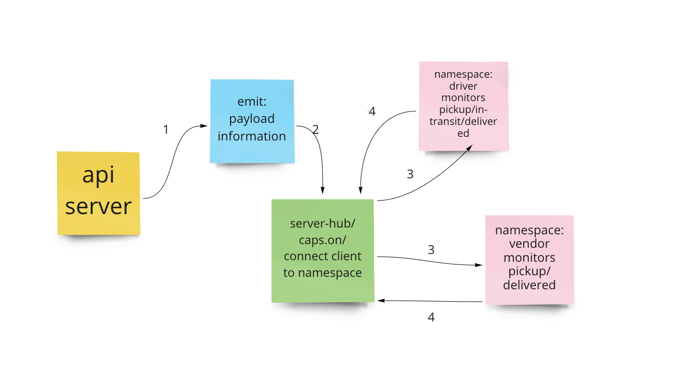

# Code 401: Advanced Software Development in Full-Stack Javascript:

## Lab 12: Socket.io

## [Github Pull Request](https://github.com/nickibaldwin/caps/pull/4)

## Setup

- Clone repo down to your machine
- In the root directory, run `npm i` to install node modules

### Architecture

```git
├── LICENSE
├── README.md
├── caps-api
│   └── api-server.js
├── drivers
│   └── driver.js
├── hub.js
├── package-lock.json
├── package.json
└── vendors
    └── vendor.js
```

### Output

```git
{
  timestamp: 2021-05-05T21:03:20.332Z,
  event: 'pickup',
  payload: {
    storeId: '1-800-flowerz',
    orderId: 'c8b6c51e-e95a-48bb-9810-4a5b963d7915',
    customer: 'Ms. Edith Will',
    address: '653 Pfeffer Green'
  }
}
{
  timestamp: 2021-05-05T21:03:22.335Z,
  event: 'in-transit',
  payload: {
    storeId: '1-800-flowerz',
    orderId: '332a250a-a57c-44e8-b642-fb4c49772350',
    customer: 'Wendell Kilback',
    address: '780 Oma Crest'
  }
}
{
  timestamp: 2021-05-05T21:03:22.336Z,
  event: 'delievered',
  payload: {
    storeId: '1-800-flowerz',
    orderId: '332a250a-a57c-44e8-b642-fb4c49772350',
    customer: 'Wendell Kilback',
    address: '780 Oma Crest'
  }
}
```
### UML



